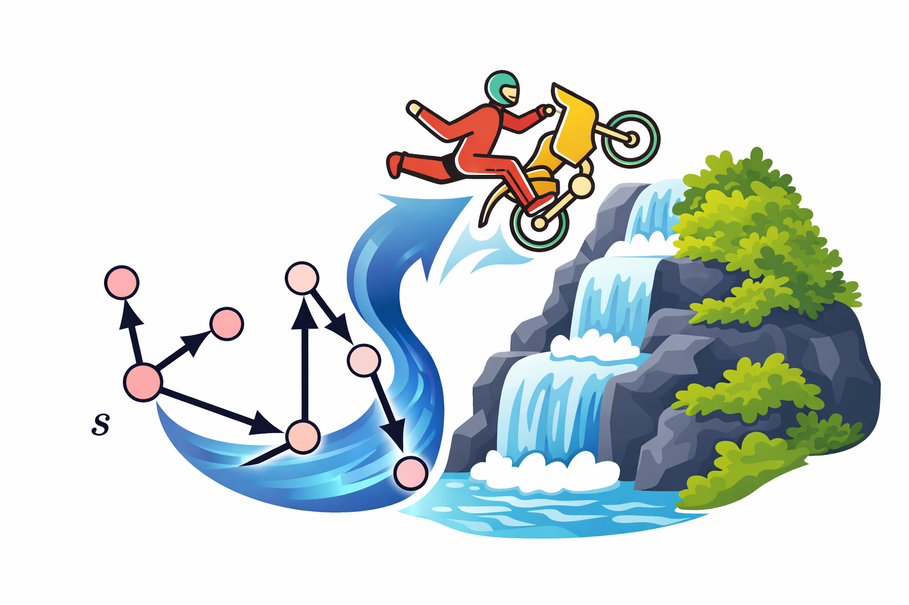
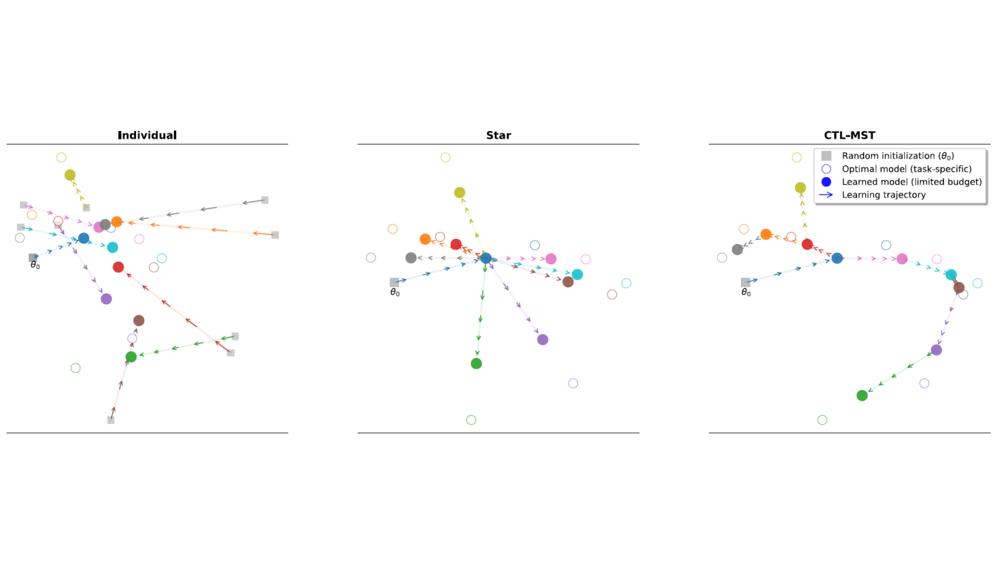
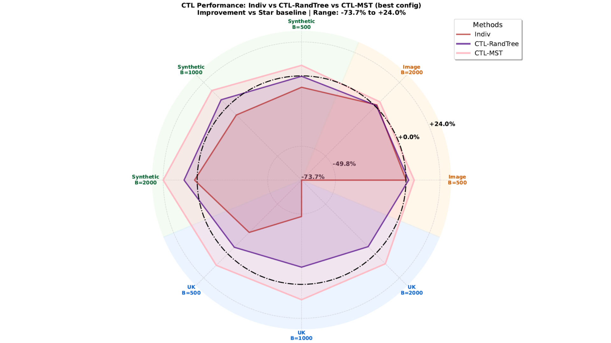

<html lang="fr">
    
<head>
    <meta charset="UTF-8">
    <meta name="viewport" content="width=device-width, initial-scale=1.0">
    <title>Cascaded Transfer: Learning Many Tasks under Budget Constraints | submitted to ICML 2026</title>
    
    <!-- Polices de caractères professionnelles depuis Google Fonts -->
    <link rel="preconnect" href="https://fonts.googleapis.com">
    <link rel="preconnect" href="https://fonts.gstatic.com" crossorigin>
    <link href="https://fonts.googleapis.com/css2?family=Inter:wght@400;700&family=Lora:ital,wght@0,400;0,600;1,400&display=swap" rel="stylesheet"> 
    <link rel="stylesheet" href="style.css">
</head> 

<body>

    

        <header>
                    

                

                    CASCADER
                    Cascaded Adaptive Source-to-Client Transfer via Dynamic Embedding and  Retraining
                

                
            

            <h1 class="paper-title">Cascaded Transfer: Learning Many Tasks under Budget Constraints</h1>
            
Submitted to ICML 2026

            
            

                <!-- 
                <a href="[Lien vers votre page personnelle]">Votre Nom</a>1,
                <a href="[Lien vers la page du co-auteur]">Nom du Co-auteur</a>2,
                <a href="[Lien vers la page du co-auteur]">Autre Co-auteur</a>1,2 
                -->
            

            
            <!--
            

                1[Nom de votre Université/Laboratoire] &nbsp;&nbsp;&nbsp;&nbsp; 2[Nom de l'autre institution]
            

            -->

            <nav class="links">
                <a href="https://github.com/cascader-ctl/CASCADER/blob/main/paper.pdf" class="button">📄 Papier</a>
                <a href="https://github.com/cascader-ctl/CASCADER" class="button">💻 Code</a>
                <!-- <a href="[Lien vers une vidéo de présentation, si applicable]" class="button">🎥 Vidéo</a> -->
                <a href="#citation" class="button">✏️ Cite</a>
            </nav>
        </header>

        <main>
            <section class="teaser">
                
                <figcaption>
                    <b>Figure 1 :</b> The Cascaded Transfer Learning (CTL) paradigm. (a) A collection of related tasks visualized over a landscape in which proximity represents task relatedness. A seed task (red) is selected among all tasks. (b) Cascaded transfer starting from the seed and refining each task in turn along a tree. Darker red color shades indicate nodes refined earlier in the process.
                </figcaption>
            </section>

            <!-- Section Abstract -->
            <section id="abstract">
                <h2>Abstract</h2>
                

Many-Task Learning refers to the setting where a large number of related tasks need to be learned, the exact relationships between tasks are not known, and budget constraints are in place. We introduce the Cascaded Transfer Learning, a novel many-task transfer learning paradigm where information (e.g. model parameters) cascades hierarchically though tasks that are learned by individual models of the same class, while respecting given budget constraints. The cascade is organized as a rooted tree that specifies the order in which tasks are learned and refined. We design a cascaded transfer mechanism deployed over a minimum spanning tree structure that connects the tasks according to a suitable distance measure, and allocates the available training budget along its branches. Experiments on synthetic and real many-task settings show that the resulting method enables more accurate and cost-effective adaptation across large task collections compared to alternative approaches.
                

            </section>

            <!-- Section Méthode -->
            <section id="method">
                <h2>Our Method</h2>
                

                    We justify CTL over rooted trees, regardless how the tree is constructed. Our analysis shows that (i) tree-structured cascades can improve over independent or pairwise transfer by routing long-range transfers through sequences of shorter ones in terms of task distance, (ii) only mild structural conditions on the tree are required, and (iii) distance-based trees such as MSTs naturally satisfy these conditions when task distances are only imperfectly observed.
                

                <!-- 
                <figcaption>
                    <b>Figure 2 :</b> [Description du diagramme de votre méthode.]
                </figcaption> -->
            </section>

            <!-- Section Résultats -->
            <section id="results">
                <h2>Experimental Results</h2>
                

                    The goal of our experiments is twofold: (i) to demonstrate that CTL effectively exploits task-graph structure to improve performance under a fixed or reduced computational budget, and (ii) to show that these gains are not specific to a particular data modality or learning problem. We therefore evaluate CTL across a diverse set of settings, including synthetic and real-world regression, as well as image-based classification tasks. Across all experiments, learning follows the same paradigm. Each task is associated with a local objective and is optimized independently using gradient-based methods. Task interactions occur exclusively through parameter initialization: each node in the cascade is initialized from its parent in the tree, after which local refinement is performed. The task graph is constructed using training data only, while all reported results are computed on held-out test data, ensuring that task relationships are inferred without access to evaluation samples.
                

                
                <figcaption>
                    <b>Figure 2 :</b> Radar plot of average percentage improvement over
direct transfer training across datasets and budgets
                </figcaption>
            </section>

            <!-- Section Citation (BibTeX) -->
            <section id="citation">
                <h2>Citation</h2>
                
 If you found our work useful, please consider citing our paper :

                <pre><code>@inproceedings{
    anonymous_2026_CTL,
    author    = {Anonymous authors},
    title     = {Cascaded Transfer: Learning Many Tasks under Budget Constraints},
    year      = {2026}
}</code></pre>
            </section>
        </main>

        <footer>
            
 Submitted to ICML 2026 

        </footer>

    

</body>
</html>
